# MÔ PHỎNG BỘ ĐIỀU KHIỂN FUZZY PID CHO QUADROTOR

## 1. Giới thiệu

Dự án xây dựng và mô phỏng bộ điều khiển **Fuzzy PID** cho Quadrotor trên nền tảng **MATLAB/Simulink**.

Mục tiêu chính của dự án là đánh giá khả năng bám quỹ đạo, ổn định vị trí và ổn định tư thế của Quadrotor khi sử dụng bộ điều khiển Fuzzy PID. Kết quả được so sánh với bộ điều khiển PID truyền thống trong hai điều kiện:

- Quadrotor hoạt động với thông số mô hình ban đầu.
- Thông số mô hình thay đổi khi Quadrotor được lắp thêm tải trọng.

Bộ điều khiển Fuzzy PID sử dụng logic mờ để hiệu chỉnh các hệ số PID dựa trên sai lệch và tốc độ thay đổi của sai lệch. Nhờ đó, bộ điều khiển có khả năng thích nghi tốt hơn khi tải trọng hoặc điều kiện hoạt động thay đổi.

---

## 2. Mục tiêu của dự án

- Xây dựng mô hình động lực học 6 bậc tự do của Quadrotor.
- Thiết kế cấu trúc điều khiển phân tầng cho vị trí và tư thế.
- Xây dựng bộ điều khiển PID truyền thống làm cơ sở so sánh.
- Thiết kế bộ điều khiển Fuzzy PID tự hiệu chỉnh tham số.
- Mô phỏng Quadrotor bay theo quỹ đạo hình vuông trong không gian ba chiều.
- So sánh khả năng bám quỹ đạo của PID và Fuzzy PID.
- Đánh giá độ vọt lố, thời gian xác lập và khả năng dập tắt dao động.
- Kiểm tra khả năng thích nghi khi khối lượng của Quadrotor thay đổi.

---

## 3. Mô hình Quadrotor

Quadrotor sử dụng cấu hình chữ **X**, gồm bốn động cơ bố trí đối xứng quanh trọng tâm:

- Hai động cơ quay theo chiều kim đồng hồ.
- Hai động cơ quay ngược chiều kim đồng hồ.
- Mô-men phản lực giữa các động cơ được triệt tiêu khi hệ thống ở trạng thái cân bằng.

Chuyển động của Quadrotor được mô tả thông qua 6 bậc tự do.

### 3.1. Chuyển động tịnh tiến

- Vị trí theo trục $x$.
- Vị trí theo trục $y$.
- Độ cao theo trục $z$.

### 3.2. Chuyển động quay

- Góc Roll $\phi$.
- Góc Pitch $\theta$.
- Góc Yaw $\psi$.

### 3.3. Đầu vào điều khiển

Các đầu vào điều khiển của mô hình gồm:

- $U_1$: tổng lực đẩy của bốn động cơ.
- $U_2$: mô-men điều khiển Roll.
- $U_3$: mô-men điều khiển Pitch.
- $U_4$: mô-men điều khiển Yaw.

---

## 4. Cấu trúc điều khiển phân tầng

Hệ thống sử dụng cấu trúc điều khiển phân tầng nhằm chia bài toán điều khiển phi tuyến và đa biến thành các vòng điều khiển nhỏ hơn.

### 4.1. Vòng điều khiển vị trí và độ cao

Vòng ngoài nhận giá trị đặt của vị trí và độ cao:

- $x_d$.
- $y_d$.
- $z_d$.

Từ sai lệch vị trí, bộ điều khiển tính toán:

- Tổng lực đẩy yêu cầu.
- Góc Roll đặt.
- Góc Pitch đặt.
- Góc Yaw đặt.

### 4.2. Vòng điều khiển tư thế

Vòng điều khiển tư thế nhận giá trị đặt của các góc:

- Roll $\phi_d$.
- Pitch $\theta_d$.
- Yaw $\psi_d$.

Bộ điều khiển tạo ra các mô-men điều khiển $U_2$, $U_3$ và $U_4$ để ổn định tư thế Quadrotor.

Cấu trúc phân tầng giúp các vòng điều khiển có thể được thiết kế và tinh chỉnh độc lập, từ đó cải thiện độ ổn định của hệ thống.

---

## 5. Bộ điều khiển PID truyền thống

Bộ điều khiển PID được mô tả bởi:

$$
u(t) =
K_p e(t)
+
K_i \int_{0}^{t} e(\tau)\,d\tau
+
K_d \frac{de(t)}{dt}
$$

Trong đó:

- $e(t)$: sai lệch giữa giá trị đặt và giá trị thực tế.
- $K_p$: hệ số tỉ lệ.
- $K_i$: hệ số tích phân.
- $K_d$: hệ số vi phân.
- $u(t)$: tín hiệu điều khiển.

### Vai trò của các thành phần PID

- Thành phần tỉ lệ $K_p e(t)$ giúp hệ thống phản ứng nhanh với sai lệch.
- Thành phần tích phân giúp giảm sai lệch xác lập.
- Thành phần vi phân giúp hạn chế dao động và cải thiện độ ổn định.

PID truyền thống có cấu trúc đơn giản và dễ triển khai. Tuy nhiên, một bộ tham số PID cố định thường chỉ phù hợp với một điều kiện hoạt động nhất định.

Khi khối lượng, tải trọng hoặc thông số mô hình thay đổi, chất lượng điều khiển có thể suy giảm.

---

## 6. Bộ điều khiển Fuzzy PID

Bộ điều khiển Fuzzy PID kết hợp bộ điều khiển PID truyền thống với một hệ suy luận mờ.

Hệ suy luận mờ tính toán các lượng hiệu chỉnh:

- $\Delta K_p$.
- $\Delta K_i$.
- $\Delta K_d$.

Các tham số PID sau khi hiệu chỉnh được xác định bởi:

$$ K_p^{*}=K_p+\Delta K_p $$

$$ K_i^{*}=K_i+\Delta K_i $$

$$ K_d^{*}=K_d+\Delta K_d $$

Tín hiệu điều khiển Fuzzy PID được xác định bởi:

$$ u(t) = \left(K_p+\Delta K_p\right)e(t) + \left(K_i+\Delta K_i\right) \int_{0}^{t}e(\tau)\,d\tau + \left(K_d+\Delta K_d\right) \frac{de(t)}{dt} $$

---

## 7. Hệ suy luận mờ

### 7.1. Đầu vào của bộ điều khiển mờ

Hệ suy luận mờ sử dụng hai đầu vào:

- Sai lệch $e(t)$.
- Tốc độ thay đổi sai lệch $de(t)$.

Trong mô hình rời rạc, tốc độ thay đổi sai lệch có thể được tính gần đúng:

$$
de(k) =
\frac{e(k)-e(k-1)}{T_s}
$$

Trong đó $T_s$ là chu kỳ lấy mẫu.

### 7.2. Đầu ra của bộ điều khiển mờ

Hệ suy luận mờ tạo ra ba đầu ra:

- $\Delta K_p$.
- $\Delta K_i$.
- $\Delta K_d$.

### 7.3. Các biến ngôn ngữ

Mỗi đầu vào được mô tả bằng 7 biến ngôn ngữ:

| Ký hiệu | Ý nghĩa |
|---|---|
| NB | Âm lớn |
| NM | Âm vừa |
| NS | Âm nhỏ |
| Z | Bằng không |
| PS | Dương nhỏ |
| PM | Dương vừa |
| PB | Dương lớn |

Với hai đầu vào và 7 biến ngôn ngữ cho mỗi đầu vào, hệ thống sử dụng:

$$
7 \times 7 = 49
$$

luật mờ cho mỗi đầu ra.

### 7.4. Quy trình suy luận mờ

Quá trình suy luận gồm ba bước:

1. **Mờ hóa:** chuyển các giá trị số của $e$ và $de$ thành mức độ thuộc của các biến ngôn ngữ.
2. **Suy luận:** áp dụng tập luật If–Then theo phương pháp Mamdani.
3. **Giải mờ:** chuyển kết quả suy luận thành các giá trị số $\Delta K_p$, $\Delta K_i$ và $\Delta K_d$.

---

## 8. Nguyên tắc xây dựng luật mờ

Bảng luật được xây dựng dựa trên trạng thái sai lệch của hệ thống.

### Khi sai lệch lớn

- Tăng $K_p$ để hệ thống phản ứng nhanh hơn.
- Hạn chế $K_i$ để tránh tích lũy sai lệch quá mức.
- Điều chỉnh $K_d$ để hạn chế dao động.

### Khi sai lệch nhỏ

- Giảm $K_p$ để hạn chế vọt lố.
- Tăng ảnh hưởng của $K_i$ để loại bỏ sai lệch xác lập.
- Điều chỉnh $K_d$ để duy trì đáp ứng ổn định.

### Khi sai lệch thay đổi nhanh

- Tăng tác động của thành phần vi phân.
- Hạn chế sự thay đổi quá nhanh của tín hiệu điều khiển.
- Giảm khả năng xuất hiện dao động lớn.
### 8.1. Hàm thành viên của đầu vào

Hai đầu vào $e(t)$ và $de(t)$ được biểu diễn bằng các hàm thành viên tam giác với 7 miền ngôn ngữ từ NB đến PB.

  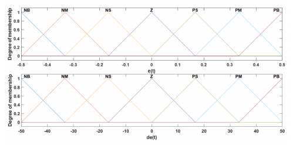

### 8.2. Hàm thành viên của đầu ra

Các đầu ra hiệu chỉnh tham số PID được mô tả bằng các mức từ rất nhỏ đến rất lớn.

  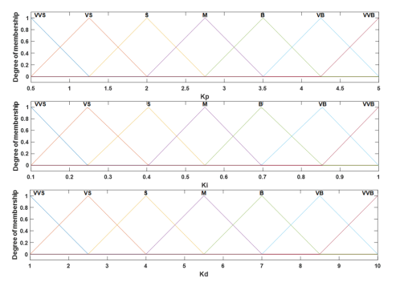

### 8.3. Bề mặt điều khiển của $K_p$ và $K_i$

Bề mặt điều khiển mô tả sự thay đổi của tham số tỉ lệ và tích phân theo sai lệch $e$ và tốc độ thay đổi sai lệch $de$.

  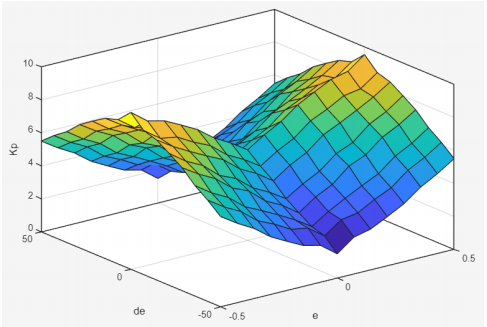

### 8.4. Bề mặt điều khiển của $K_d$

Bề mặt điều khiển $K_d$ thể hiện cách thành phần vi phân được điều chỉnh để hạn chế dao động và cải thiện khả năng ổn định.

  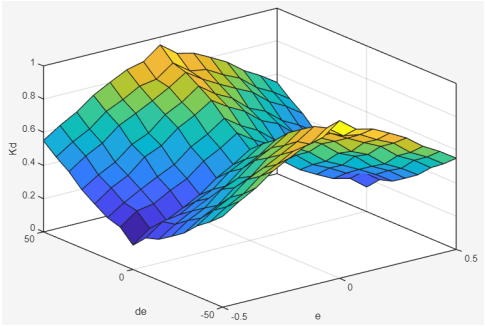

---

## 9. Kịch bản mô phỏng

Quadrotor được yêu cầu bay theo quỹ đạo hình vuông trong không gian ba chiều. Hai bộ điều khiển được mô phỏng trong cùng điều kiện:

- PID truyền thống.
- Fuzzy PID.

### Kịch bản 1: Thông số mô hình ban đầu

Quadrotor hoạt động với khối lượng và thông số mô hình danh định.

Mục tiêu là đánh giá:

- Khả năng cất cánh và giữ độ cao.
- Khả năng bám quỹ đạo.
- Khả năng ổn định Roll, Pitch và Yaw.
- Độ vọt lố và thời gian xác lập.

### Kịch bản 2: Lắp thêm tải trọng

Khối lượng của Quadrotor được thay đổi bằng cách bổ sung tải trọng.

Bộ tham số PID truyền thống được giữ cố định, trong khi Fuzzy PID tiếp tục hiệu chỉnh các hệ số điều khiển theo sai lệch của hệ thống.

Mục tiêu là đánh giá khả năng thích nghi khi thông số thực tế không còn giống điều kiện thiết kế ban đầu.

---

## 10. Kết quả mô phỏng – Kịch bản 1

### 10.1. Đáp ứng vị trí

Đồ thị thể hiện vị trí thực tế theo các trục $x$, $y$, $z$ so với quỹ đạo đặt.

  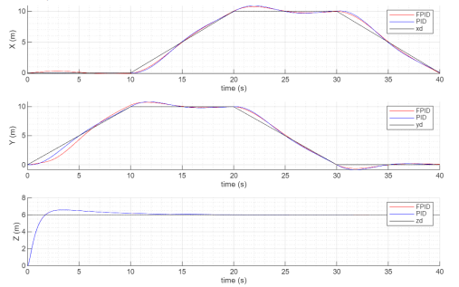

### 10.2. Sai số vị trí

Sai số vị trí được xác định bởi:

$$
e_x=x_d-x
$$

$$
e_y=y_d-y
$$

$$
e_z=z_d-z
$$

  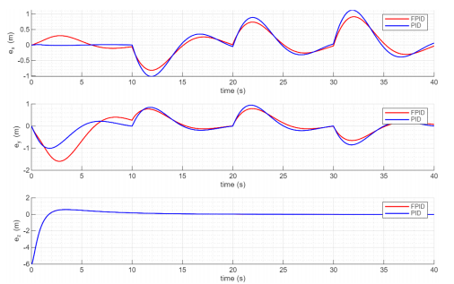

### 10.3. Đáp ứng tư thế

Đồ thị so sánh Roll, Pitch và Yaw của PID và Fuzzy PID với giá trị đặt.

  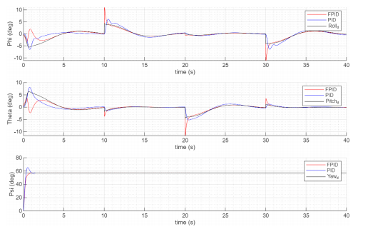

### 10.4. Sai số tư thế

Sai số tư thế được xác định bởi:

$$
e_{\phi}=\phi_d-\phi
$$

$$
e_{\theta}=\theta_d-\theta
$$

$$
e_{\psi}=\psi_d-\psi
$$

  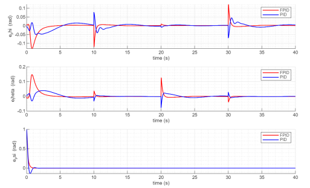

### 10.5. Nhận xét

- PID và Fuzzy PID đều có khả năng bám quỹ đạo trong điều kiện danh định.
- Trong giai đoạn khởi động, PID có thể tạo ra đáp ứng nhanh hơn ở một số trục.
- Tại các thời điểm thay đổi hướng, Fuzzy PID có khả năng dập tắt dao động nhanh hơn.
- Sai số Yaw của Fuzzy PID hội tụ nhanh và hạn chế vọt lố âm tốt hơn trong kết quả mô phỏng.

---

## 11. Kết quả mô phỏng – Kịch bản 2

### 11.1. Đáp ứng vị trí

  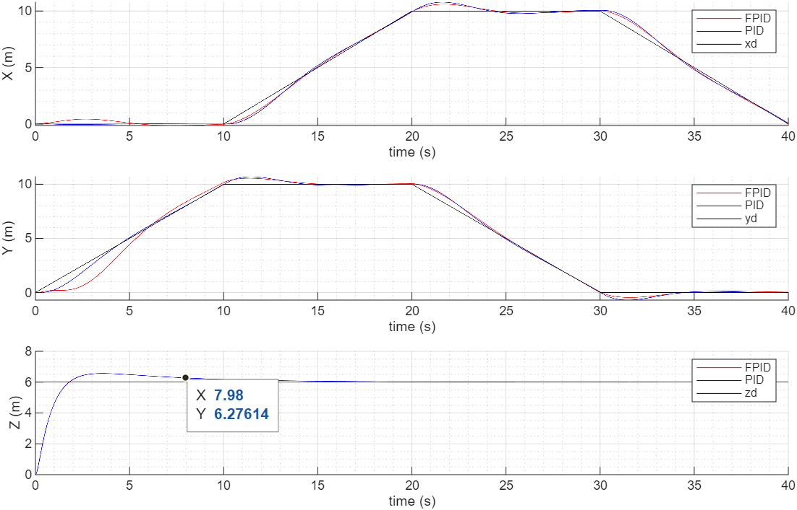

### 11.2. Sai số vị trí

  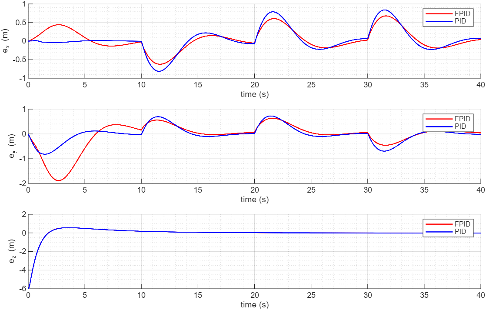

### 11.3. Đáp ứng tư thế

  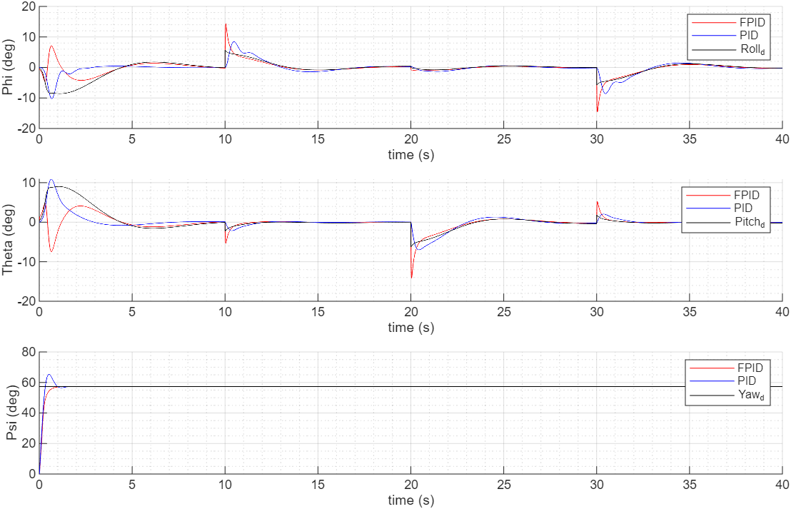

### 11.4. Sai số tư thế

  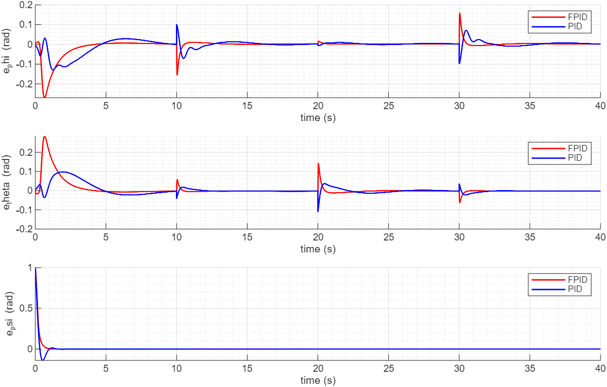

### 11.5. Nhận xét

- Khi tải trọng thay đổi, chất lượng đáp ứng của PID truyền thống bị ảnh hưởng do các hệ số $K_p$, $K_i$, $K_d$ được giữ cố định.
- Fuzzy PID tiếp tục điều chỉnh tham số theo trạng thái sai lệch của hệ thống.
- Kết quả mô phỏng cho thấy Fuzzy PID có khả năng thích nghi tốt hơn khi thông số mô hình thay đổi.
- Ở một số thời điểm chuyển hướng, Fuzzy PID có thể xuất hiện đỉnh sai số tức thời lớn hơn, nhưng dao động được dập tắt nhanh hơn.

---

## 12. Tổng hợp đánh giá

Qua hai kịch bản mô phỏng, có thể rút ra các nhận xét chính:

- PID truyền thống có cấu trúc đơn giản và đạt kết quả tốt khi hệ thống hoạt động gần điều kiện thiết kế.
- Chất lượng PID có thể giảm khi tải trọng hoặc thông số mô hình thay đổi.
- Fuzzy PID có khả năng hiệu chỉnh tham số theo trạng thái sai lệch.
- Fuzzy PID cải thiện khả năng dập tắt dao động và khả năng thích nghi.
- Kết luận hiện tại dựa trên quan sát đồ thị mô phỏng; cần bổ sung các chỉ tiêu định lượng để đánh giá khách quan hơn.

Các chỉ tiêu nên bổ sung:

- IAE – Integral of Absolute Error.
- ISE – Integral of Squared Error.
- ITAE – Integral of Time-weighted Absolute Error.
- RMSE – Root Mean Square Error.
- Độ vọt lố.
- Thời gian xác lập.

---

## 13. Công cụ sử dụng

- MATLAB.
- Simulink.
- Fuzzy Logic Toolbox.
- Control System Toolbox.

---

